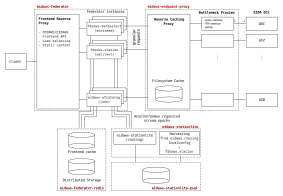

.. _NGINX: http://nginx.org/
.. _PostgreSQL: https://www.postgresql.org/

==========================================
eidaws-federator Docker Compose Deployment
==========================================

This manual describes how to quickly deploy a containerized version of
``eidaws-federator`` using a `Compose file
<https://docs.docker.com/compose/compose-file/>`_.

For a detailed description of the underlying architecture, please refer to
`Architecture`_.

Prerequisites
=============

A basic knowledge about container engines (e.g. `Podman <https://podman.io/>`_,
`Docker <https://docs.docker.com/engine/>`_) and how application containers work
is required. For more information about operating system support (which
includes Linux, macOS and specific versions of Windows) and on how to install a
container engine please refer to the official websites, e.g. `Podman website
<https://podman.io/getting-started/installation>`_, `Docker website
<https://www.docker.com/products/docker>`_.

To get started, first of all clone the repositories containing the code
required:

.. code::

  $ git clone --recurse-submodules https://github.com/EIDA/eidaws-federator-deployment.git && \
    cd eidaws-federator-deployment/docker-compose

Building
========

The ``eidaws-federator`` deployment is subdevided into several components. While
some of the container images are downloaded from a container registry the
following containers must be build manually:

eidaws-endpoint-proxy
---------------------

In order to build ``eidaws-endpoint-proxy`` container image, invoke

.. code::

  $ docker build -t eidaws-endpoint-proxy:1.0 -f proxy/Dockerfile .

The ``eidaws-endpoint-proxy`` container implements both proxy facilites and
caching facilities.

eidaws-stationlite
------------------

``eidaws-stationlite`` implements ``eidaws-federator``'s routing facilities.

Before building and running the ``eidaws-stationlite`` container adjust the
variables defined within the ``docker-compose/env`` configuration file
according to your needs. Make sure to pick a proper username and password for
the internally used PostgreSQL_ database and write these down for later.

Next, build the ``eidaws-stationlite`` container image with

.. code::

  $ docker build -t eidaws-stationlite:1.0 -f stationlite/Dockerfile .

eidaws-federator
----------------

Finally, it is time to build ``eidaws-federator``, the actual federating
service component:

.. code::

  $ docker build [--build-arg=INSTANCE_XXX=20] -t eidaws-federator:1.0 \
    -f federator/Dockerfile .

Note that the ``federator/Dockerfile`` allows the number of backend
applications to be configured during build time. The build args
``INSTANCES_DATASELECT_MINISEED``, ``INSTANCES_STATION_TEXT``,
``INSTANCES_STATION_XML`` and ``INSTANCES_WFCATALOG_JSON`` are provided in
order to configure the number of federating backend services.

Deployment
==========

In case you want to manage your own volumes now is the time. The configuration
provided relies on named `container volumes
<https://docs.docker.com/storage/volumes/>`_.

The containers should be run using the provided ``docker-compose.yml``
configuration file.

.. code::

  $ docker-compose -f docker-compose.yml up -d

If you're deploying the services for the very first time you are required to
create the database schema

.. code::

  $ docker exec eidaws-stationlite \
    /var/www/eidaws-stationlite/venv/bin/flask db-init

and perform an inital harvesting run

.. code::

  $ docker exec eidaws-stationlite \
    /var/www/eidaws-stationlite/venv/bin/eida-stationlite-harvest \
     --config /etc/eidaws/eidaws_stationlite_harvest_config.yml

When the containers are running the service is available under
``http://localhost:8080`` (the internally used ``eidaws-stationlite`` routing
service is available under ``http://localhost:8089``).

Architecture
============

The Compose deployment will deploy the system depicted in the figure above.
Dashed boxes mark the container image components involved. Their corresponding
names are indicated in red.

``eidaws-federator`` provides a single, unified gateway to the waveform
archives and the station and quality control information from the entire EIDA
data holdings, i.e. from all the datacenters (DCs) in EIDA. It's *frontend
reverse proxy* implements standard FDSNWS and EIDAWS APIs.

If a client request reaches the frontend reverse proxy, the request is
dispatched and redirected to the corresponding federating instance. The
federating service then follows the procedure:

1. Check if the request was already received before and perform a frontend
   cache lookup (currently ``fdsnws-station`` metadata, only). If there is a
   cache hit the response is immediately returned to the client.
2. In case of a frontend cache miss requested stream epochs are fully resolved
   by means of ``eidaws-stationlite`` routing service. Thus, from now on, data is
   requested based on a granular (devide-and-conquer) request strategy from the
   *reverse caching proxy*.
3. Again, the reverse caching proxy has an internal cache (backend cache)
   (currently ``fdsnws-station`` metadata, only). Only in case the reverse
   caching proxy has a cache miss the (still granular) request is redirected to
   so called *bottleneck proxies*. Bottleneck proxies implement access
   limitation in order to prevent EIDA DCs from being overloaded.
4. Depending on the federated resource (``service-dataformat``) the federating
   instance firstly merges the granularly requested data before streaming the
   content back to the client.
5. Note that meanwhile the health status of EIDA DCs is monitored. If a DC
   cannot serve data it is temporarily excluded from data federation.

Static content is served by the frontend reverse proxy, directly.

``eidaws-stationlite``'s harvesting facility periodically harvests routing
information from `eidaws-routing <https://github.com/EIDA/routing>`_
``localconfig`` configuration files and to some extent from ``fdsnws-station``.
Hence, storing the routing information adds another, third, caching layer to
the overall architecture.

In order to keep the backend cache for ``fdsnws-station`` metadata requests
hot, ``eidaws-federator`` implements a crawler which again is based on
``eidaws-stationlite`` routing information. This way, federated
``fdsnws-station`` metadata requests can be served more efficiently.

Features provided
=================

* Based on `baseimage <https://hub.docker.com/r/phusion/baseimage/>`_
* NGINX_ + configurable number of standalone backend
  applications
* Backend caching powered by a NGINX_ HTTP reverse caching proxy
  (currently for ``fdsnws-station`` metadata, only)
* Bandwith limitation while fetching data from endpoints (implemented by
  ``eidaws-endpoint-proxy``)
* ``eidaws-stationlite`` deployed with `Apache2 <https://httpd.apache.org/>`_ +
  `mod_wsgi <https://modwsgi.readthedocs.io/en/develop/>`_; harvesting via
  ``cron`` powered by PostgreSQL_
* `OpenAPI <https://swagger.io/specification/>`_ API documentation with
  `Swagger-UI <https://swagger.io/tools/swagger-ui/>`_
* Python3.6/3.7
* Logging (syslog)

.. note::

  Currently, ``fdsnws-availability`` resources are not part of the container
  deployment.
